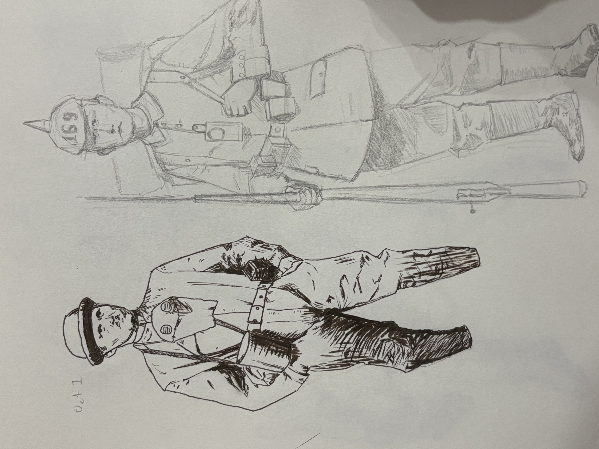

I've been inspired by Karl Kopinski lately so I've started drawing soldiers and astronauts. I had a couple things I wanted to practice with this type of drawing:

*   Get better at drawing bags, cloth, accessories, etc.
    
*   Start with a very loose sketch and then tighten it up in pen, like Kopinski often does.
    

This method of drawing, which I've dubbed _Loose Pencils, Tight Ink_, is fun because it avoids the exhaustive process of creating a detailed drawing in pencil and then having to go over it all in ink. However, it also requires some skill and delicacy since you do not have all the visual information down while inking.

Here are a couple other soldier drawings I did with similar aspirations, but these were done with tight pencil sketches or were not inked: 