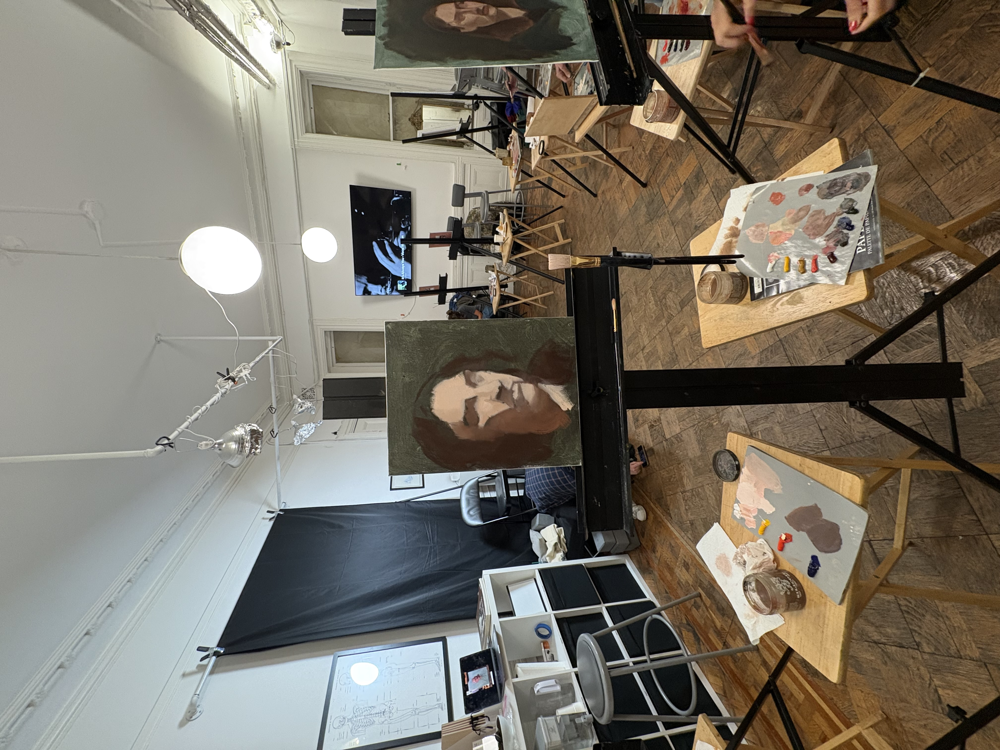

I did these paintings at a class that supplied all materials. Each painting was 2-2.5 hours, which is a relatively short amount of time for an oil painting, and they were all from a live model.

Being new to painting, there were a lot of new factors I had to consider while doing these. When putting brush to canvas, it briefly felt as if I had forgotten how to draw. A pencil or pen are precise tools so the thickness of a brush felt clumsy, but I quickly got over it as I had more important matters to attend to.

Managing your paint materials is akin to managing a kitchen. You’re taking measurements and it’s messy, and you’re under the duress of finite time. Your pots and pans are your brushes, solvents, and paints. There’s a rhythm to find that makes managing everything run smoothly, otherwise you’ll be fighting your materials when you should be fighting to make something that looks like a human head on canvas.

This was my very first painting. I used a full pallet of 8 colors. We were taught to *tone* our canvasses, so the blue shade in the background is the tone. I should have made it darker, since I was painting a model with a dark background. Color hues and values are local, so changing the background color can substantially change the look of the figure you’re painting. Mixing paints is an art in itself, and here I couldn’t quite get normal, human looking colors, but she has an earthy hue that I don’t mind too much. I think I placed the shadows solidly, and her look is sort of expressive.

In my second painting, I moved to a simplified pallet of primary colors (red, yellow, blue) + white. A primary color pallet is what most painters should start with, so that you can learn what colors actually look like and what they are made up of. Adding more colors to a pallet is an acceptable shortcut that painters will begin to use later on, but for now I wanted to mix everything. I think this painting is fine. It looks more like the model, and I have real colors going on. However, it’s mostly two tone. I have the hard shadows and lights, but I’m missing most of the transitional values.

In my final painting, I continued with the primary color pallet, and I also used two separate brushes for light and dark values. This made applying paints considerably easier. Something substantial I learned from my instructor during this painting is that I should consider the color of the shadows. Cold colored shadows can make a figure look lifeless. I tried course correcting to warmer shadows near the end of the session. I also have a nice value transition on the cheek.

Overall, I loved doing oil paints. It adds a whole new dimension to drawing, and I love wrangling the complexity of it all. I can’t wait to do more, and it’s piqued my interest in the paintings of Masters. But, the basis of all art, even painting, is still drawing!
