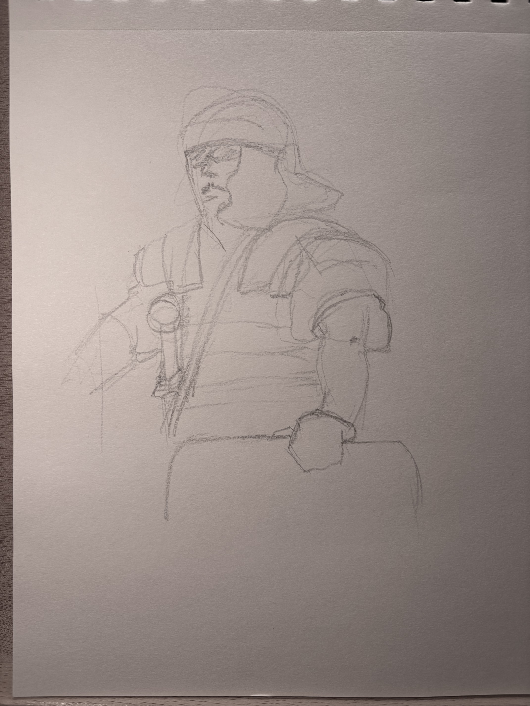

This is a continuation of my Kopinski inspired drawing. The shadows under the armor plates were hard to get right in ink, but I like the face.

I took a picture of my loose pencils, so I wanted to show it here. I moved straight to inking from the sketch you see below. Notice how much more detail is in the inking. It's a practiced skill!

