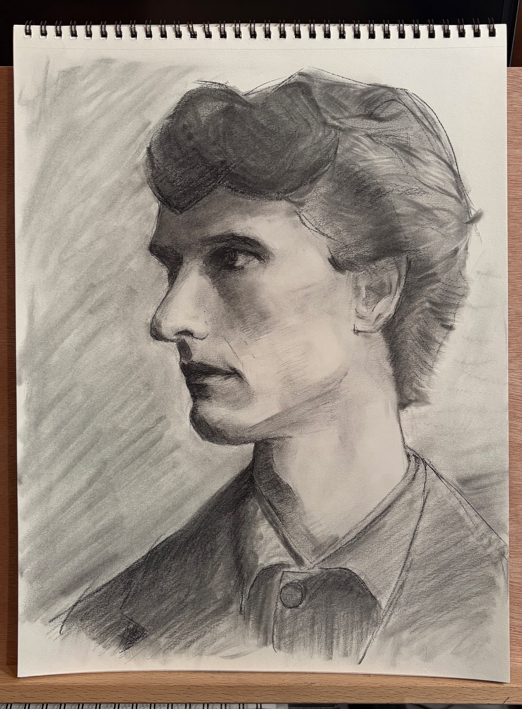

At the end of my last post, I mentioned that I would be focusing on value and rendering, and that’s exactly what I’ve done! It turns out graphite is an arduous medium for creating rendered drawings with a wide value range. At the advice of internet people, I’ve started using charcoal, a lot. The following is a chronological gallery of what I’ve been doing with Charcoal the past month.

<!-- {"width":322} -->
This was my first attempt with charcoal. I lacked dexterity with it, but I could tell that it was immediately easier to get a greater value range. I kind of like the drawing, but the proportions are more off than I can condone. I believe this is because I was using a lot of brain-bytes trying to manipulate the charcoal. I’ve found that when trying out new drawing skills, it causes other things to suffer a little, like my proportions here.

<!-- {"width":371} -->
In this attempt, I used a different type of charcoal that is a little more waxy and less dusty. I have my shadows and lights separated well here, but there’s a lack of halftones and transitional values.

<!-- {"width":522} -->
Now this was my first charcoal drawing that felt like something. Through my practice I had built up some dexterity with charcoal. I became more familiar with how it moves on the page and was able to spread it around with my finger to create halftones with it. Sharpening my tools properly with a razor and sandpaper also helped a lot. I like the form of her hair and the overall gesture of the head and face.

<!-- {"width":322} --><!-- {"width":297} -->
Then I began learning how to draw drapery with charcoal as preparation for a small project. I had to build even greater dexterity. Not only controlling values but also their hard and soft transitions, which is very important for the folds of drapery. These are semi-successful.

I really like this piece, and it’s the only art I’ve given to someone else! This is the small project that I prepped for. I had to make sure I could draw the folds of her clothes well. And charcoal doesn’t always erase well, so I knew I couldn’t totally botch it. My youngest cousin had taken some interest in drawing the past few months. Over the holidays she even drew with me, and I let her draw in my sketchbook, so I decided to gift her some supplies. I drew this in a sketchbook and sent it to her. The reference is a photo of [*The Annunciation* sculpture by Sigrid Blomberg](https://swedishmuseum.org/2021/05/21/the-annunciation/). 

I did this piece for a bi-weekly challenge that is held by the internet forum I’ve joined. It took about 4 hours. I’m pretty happy with the rendering, but the proportions look slightly goofy. As a result, I vowed to never again allow a drawing to fail due to its proportions. What am I, an amateur? I also like the composition, which has been something I’ve made a priority, even in more casual sketches and drawings. It makes a surprising difference, even if the drawing itself is subpar.

In my vindication, I came back with this 6 hour study. Not only was I able to go very dark with the charcoal, but I could also spread it around with my finger, which helped make the midtones you can see in places like the side of the nose. I used an eraser to emphasize the highlights. I’m especially happy with this since I managed the complex lighting situation where his face is lit by ambient light and also a brighter light source shining from the left. The proportions, values, and composition are all done well.

Charcoal is such an excellent artist tool. It’s what most traditional art academies will teach you with, and there’s also tons of [wonderful artwork](https://npg.si.edu/exhibition/john-singer-sargent-portraits-charcoal) done in charcoal. I would say that it’s really a necessity if you want to learn how to control values well, since it actually enables you to lay them down. I still do casual sketches in graphite, but charcoal is now my go-to for more finished drawings. If you want to learn more about charcoal and also get a hint at where my art journey is taking me, check out this [thoroughly written article](https://anthonywaichulis.com/charcoalpastel-vs-graphite-as-a-precursor-to-oil-painting/).
