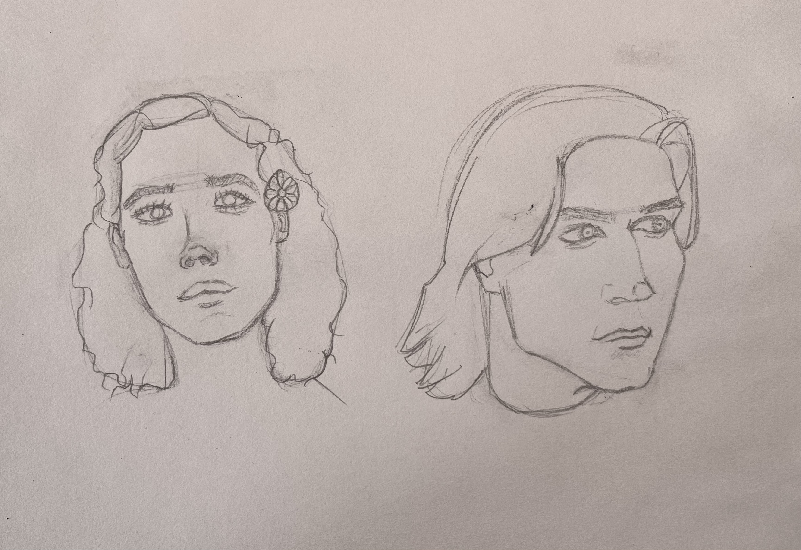

I view this piece as a turning point in my ability to draw portraits. Rendering and values have long been something I’ve neglected to study, but they are inherently important when creating portraits. After watching Katie Maeve draw and really grasping how to see values, my portraits have gotten much better.

Part of this understanding of values is the understanding of how to draw facial features with value rather than lines. When you’re drawing lines instead of values, your portraits will end up looking like this:

Date: March 2024

Now while there’s a lot of things wrong with these portraits, you can see that I’m drawing what the art community calls “symbols” for the features of the face, rather than what the features actually look like. I did this most conspicuously with their eyes, which I’ve drawn in almond shapes like many new artists do.

In my more recent portrait, you can see that I let white/light value blend into the eyes and lips. That is drawing with value, and it has improved my portraits substantially.
