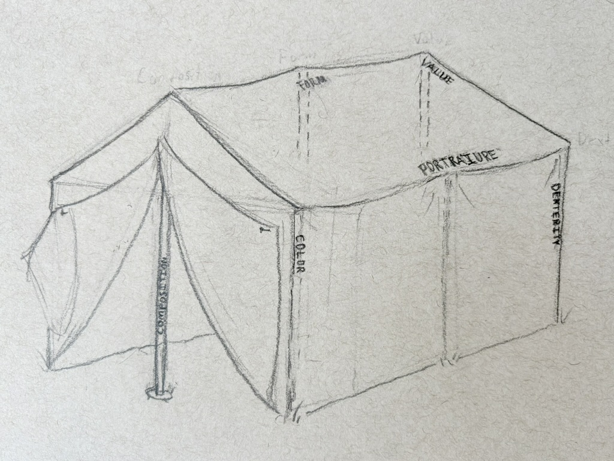
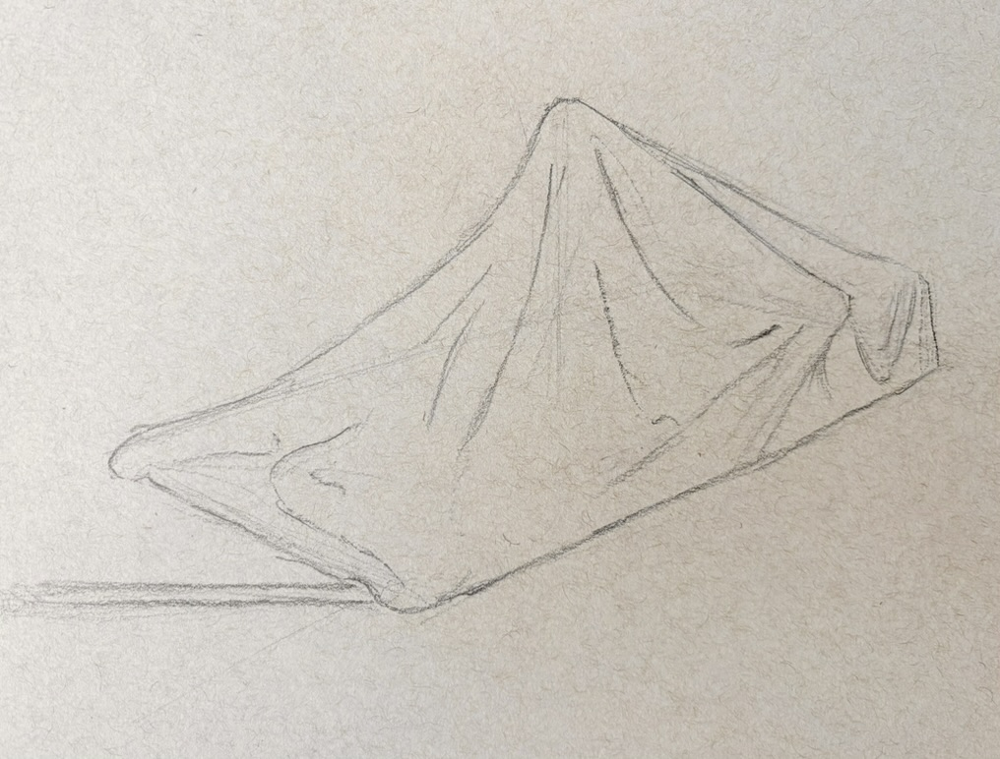

Art, whether it’s a painting, comic, or animated movie, is one of the most widely accessible and universal forms of entertainment. Even so, artistic skill has a culture of mysticism and high brow learning surrounding it. Many laymen don’t understand that drawing is a practiced skill, like a trade, rather than something acquired at birth. On the other side, most art schools don’t teach the fundamentals needed to become a skilled artist, leaning into abstract and expressionist work. Or, they’ve developed convoluted methods of learning that’s unnecessary and inaccessible to the average person. There’s also a proliferation of plainly bad advice on social media and the internet. Misinformation and a lack of good contemporary academic grounding makes it exceptionally difficult for beginners to become good at art when learning on their own. However, learning art can be simple, and all art is built on the same fundamental skills. So, instead of providing yet another roadmap for what and how long fundamentals should be studied or even give a specific lesson on improving fundamental skills, I want to establish a generalized framework for learning that can offer guidance to young artists in hopes that they will not stray from reasonable learning.

An unofficial and non-exhaustive list of fundamentals include:
* Composition
* Value
* Gesture
* Form
* Dexterity/Linework
* Portraiture

These fundamentals are the foundation of an artist’s work, the scaffolding that supports and elevates it. Strong foundations allow the artist to focus on the subject of their work, enabling creative freedom to express what they will, rather than struggling to command their work. The importance of fundamentals can’t be understated, but some artists neglect them and simply follow their own whims of creativity, which ultimately, in my opinion, leads to a limited ability to create interesting work. In contrast, but also detrimental to improving skill, young artists will pursue improving the fundamentals but do so incompetently. They lead themselves astray by harping on a single fundamental to exhaustion, and, although they may have limited results in their chosen obsession, they are likely to be demotivated by their monotonous learning. Of course, these artists have good intentions, but people often look for efficient methods of learning, which can lead to relatively extreme methods of learning, or they have no method at all. 

## Cyclical Learning
If an artist is to avoid both a lack of regiment and an over regimented education, then they must strike a balance. The correct balance will change from one artist to another, but hopefully after reading this article you’ll be able to steer yourself onto a good path for learning

The path to becoming a master is not by attempting to master one fundamental before moving to the next. It is refining all of your fundamental skills repeatedly until your work is brought up to a master’s level. You work on skills, move on to a new skill, and then return to refine old skills, which in turn elevates your work as a whole.

In this diagram I show the fundamental skills as poles of a tent. Each pole carries its share of weight, but if another pole is missing or too short then the tent will still sag and stop functioning in its purpose. 

You may raise a single tent pole very high, but it does not make your tent much better. I will attempt to stop saying poles soon, but if you raise all of your poles similarly then you will have a decent tent all the while and the higher the poles, the greater your tent. All this to say that if you improve all of your skills, then you will create better work as a result, and if you neglect your poles then you will not have a good tent!
!

I suggest artists uptake a round robin form of education by simply trying new things and also returning to old things. Do not look at a new medium or subject as something you are just “bad” at, but instead as a new thing to learn that will improve all the work you do. This keeps an artist from stagnating and also sustains interest. I find that there are even great artists who seem to have stuck with what works for them and their career, and their work seems to have more or less been of a similar quality for years. This also happens to beginner artists. For example, a beginner may like to draw anime, but then all they draw is anime for years. They may get better at copying anime,  but soon their skills stagnate. This isn’t to say that they don’t move on to new things eventually, but much time and effort could be saved if they were consistently pushing into new territory.

I have also seen artists who do push into doing new things but neglect some fundamental skills, and as a result all of their work is held back by it. [Rob Liefeld](https://www.youtube.com/watch?v=jRMTCQgEVuM) is a contemporary example of this. He created exciting, fresh comics, but his ineptitude at drawing the figure came back to bite him (although I think he’s hated far too much).

## Getting Started, Broadly
Draw from life. Whether it's from a photo or something right in front of you, being able to represent life naturally is going to build the strongest foundation for whatever you want to do. Sprinkle in different mediums in your practice, but the majority of your learning is best to be done in graphite and charcoal. Quick sketches (10 minutes to an hour) are valuable for getting repetitions and lots of practice. Longer drawings (multiple hours) are great for improving your rendering skills and getting more accurate and finished pieces. Do both! Lastly, although controversal, I recommend learning with traditional materials (not digital). This simplifies things for you, and digital is more likely to hold you back in the beginning than help you.

Learn from different teachers, read from different books, and don’t subscribe yourself to only one source of information. There isn't really one "right" way to do anything (although I do recommend avoiding complicated techniques in favor of simplicity). Everything you learn you will carry with you, and, in my opinion, having some variety will make you a more interesting artist.

Seek feedback, but only listen to good feedback. Good feedback usually critiques or touches on your fundamental skills, rather than superficial details of your drawing.

Be interested in other artists! Find artists you love and attempt to understand why you love them.

## As You Get Better
As you refine your skills, you’ll find that some things that used to be hard are now easier. This opens up your cognition (or brain bytes as I like to call it. It’s also a similar concept to spinning plates.) to focus on more and reach further while making art. When you are better at a certain skill, it allows you to focus on other things. I think this is the basic mechanism of getting better! Although this seems like a simple concept, it provides a lot of insight on how we learn and how we can approach learning. For example, an artist that has difficulty creating a tolerably fair portrait in Charcoal, which only requires manipulation of light and dark values, will have even more trouble creating a fair portrait in Oil paints, because it requires the manipulation of value *and* color. Now, this isn’t to say that you should withhold yourself from doing anything until you consider yourself ready. In fact, don't do that. It should instead inform you of what skills you may need to improve *after* attempting the thing that is hard or unfamiliar.

In my opinion, to become a great artist you need to push into the unfamiliar. Seek it as a challenge to overcome. The process of exploring new things shouldn’t be overly stressful, but instead you can hopefully follow your curiosity where it takes you while not letting your fear tame you. There are literally zero stakes in trying a new medium or drawing a subject you’re unfamiliar with. I encourage artists to take an optimistic and mature approach to learning that is not demeaning or centered on insecurity. Also, take a look at your old work every once in a while to see how far you’ve come.