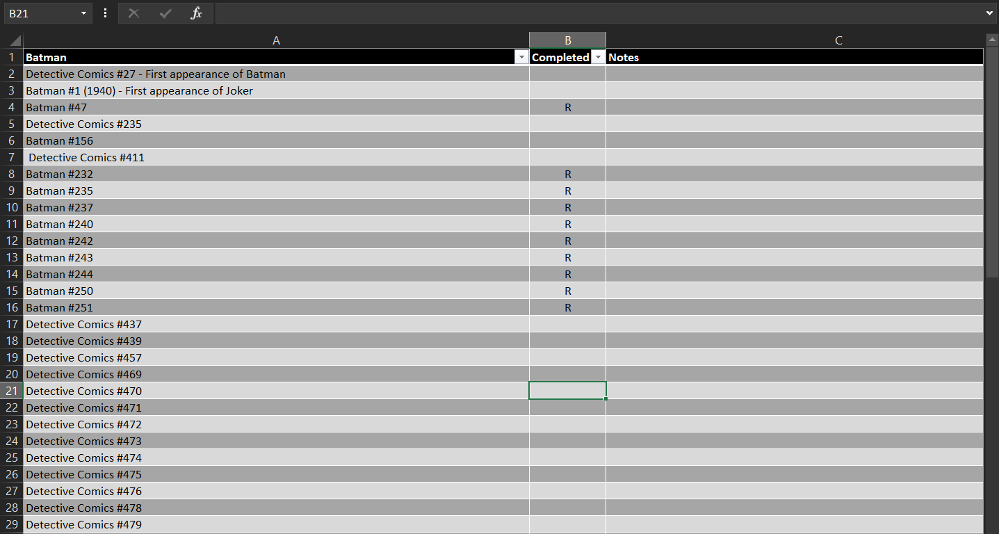

# comic-list-webscraper
[Github Repo](https://github.com/jacob-armiger/comic-list-web-scraper)  
  
This tool enables readers to track comics they’ve read from [comicbookreadingorders.com](https://www.comicbookreadingorders.com). Each reading order is on its own page, so readers copy the URL into the prompt on my [web app](https://www.comicbookreadingordersdownload.com) and get an excel sheet in return (like below).

This project started as a Python script I made for myself. Although I know literally zero other people that read comics, I eventually thought that others may find this tool useful too. I decided to contact the creator of the website above to gauge interest and it turns out that users have asked for features just like this. 

Initally I wanted to distribute an executable with the `pyInstaller` library, but I quickly had compatibility issues with my M1 laptop (which was relatively new at the time), and EV certificates were never going to trust me anyway. As a result I pivoted into using flask and Heroku. That was super easy to set up.

The page I set up emulates the style of comicbookreadingorders.com, but it’s hosted separately on a different domain. In the future I'd like to rewrite the script from Python to JavaScipt so I can host the site for free on Vercel.